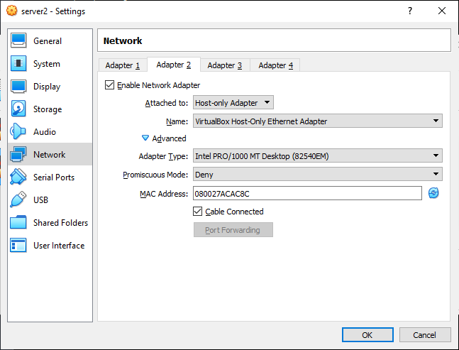

# local-development


This computer is too slow for Vagrant. Place your nodejs app in a folder called app in this folder. uses a git hook to deploy to Linux Virtual machine whenever you commit.

 * handles deployment for you
 * git push to deploy to local Ubuntu virtual machine
 * autocommit script to commit your work while you are in development
 * live-reload functionality of `create-react-app`

So you can use Windows development tools but deploy to a Linux environment and lose none of the debugging tools that are provided within the Linux environment.

# Quickstart

This project lets you develop in Windows and deploys an application to a local virtual machine using git.

1. Install VirtualBox, git bash
2. Download ubuntu server ISO
3. On Windows run `ssh-keygen`
4. In VirtualBox, create a new virtual machine and attach the ISO as an optical disc
5. Go to settings for created VM and in network, forward ports 3000 to 3000 and 2222 to 22
6. In VirtualBox, Preferences, Network, Create a network. Add host only adapter to your VM

7. Enable [passwordless SSH](https://linuxize.com/post/how-to-setup-passwordless-ssh-login/) by:
8. In `/etc/ssh/sshd_config` ensure these are set

```
PasswordAuthentication no
ChallengeResponseAuthentication no
UsePAM no
AuthorizedKeysFile ssh/authorized_keys .ssh/authorized_keys2
```
9. Enable passwordless sudo, sudo visudo
```
ALL            ALL = (ALL) NOPASSWD: ALL
```
10. Copy your public key to `~/.ssh/authorized_keys`.
11. (You can either create a key in windows and share the public key to the guest or create a key in the vm and share the private key, I prefer sharing the public key with the VM and create the key from windows) In Windows create a folder, put your public key here, In virtualbox add a shared folder to the VM, **remember the name you gave it to virtualbox**, then mount the shared folder with:

```
mkdir /mnt/sharedName
sudo mount -t vboxsf sharedName /mnt/sharedName
```
10. Update `ssh_config` in this directory for the path to your key.
11. Run `./setup`
12. Now change App.js or index.html and the page will automatically be deployed.

